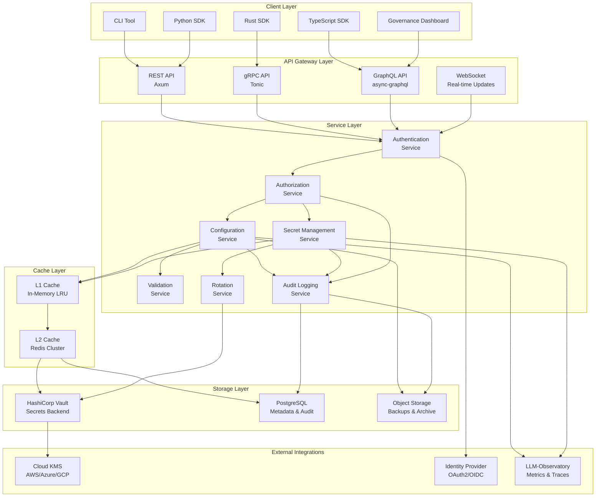
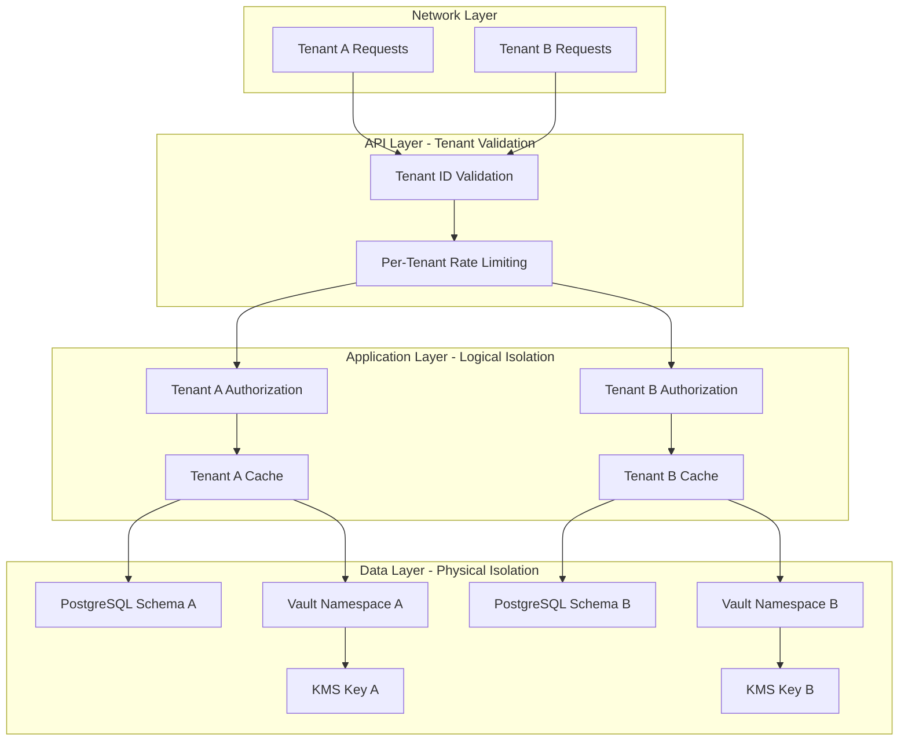

# 3. ARCHITECTURE

**Project:** LLM-Config-Manager
**SPARC Phase:** Architecture
**Version:** 1.0.0
**Date:** 2025-11-21
**Status:** Complete

---

## Table of Contents

1. [System Architecture Overview](#31-system-architecture-overview)
2. [Component Design](#32-component-design)
3. [Configuration Schema Definition](#33-configuration-schema-definition)
4. [Data Models](#34-data-models)
5. [Integration Patterns](#35-integration-patterns)
6. [Deployment Models](#36-deployment-models)
7. [Multi-Tenant Isolation](#37-multi-tenant-isolation)

---

## 3.1 System Architecture Overview

### 3.1.1 High-Level Architecture

The LLM-Config-Manager follows a **centralized configuration service with distributed caching** architecture pattern, designed for high availability, security, and performance.



### 3.1.2 Architectural Principles

| Principle | Implementation | Rationale |
|-----------|----------------|-----------|
| **Defense in Depth** | Multiple security layers (network, authentication, authorization, encryption) | No single point of failure in security |
| **Zero Trust** | Verify every request, no implicit trust between services | Modern security posture for production systems |
| **Fail Secure** | Default deny for authorization, graceful degradation | Security over availability for sensitive operations |
| **Performance First** | Multi-layer caching, async I/O, connection pooling | Configuration lookups in critical path |
| **Horizontal Scalability** | Stateless API servers, distributed caching | Support for large-scale deployments |
| **Event-Driven** | Pub/sub for configuration changes, async processing | Decoupling and real-time updates |
| **Idempotency** | All write operations idempotent | Retry safety in distributed systems |
| **Observability** | Comprehensive logging, metrics, tracing | Operational visibility and debugging |

### 3.1.3 Key Architectural Decisions

#### ADR-001: Rust as Implementation Language
**Decision:** Implement core services in Rust
**Rationale:**
- Memory safety without garbage collection
- Performance comparable to C/C++
- Strong type system prevents common bugs
- Excellent async/await support with Tokio
- Growing ecosystem for web services

**Consequences:**
- Steeper learning curve for team
- Fewer third-party libraries than Java/Python
- Compile times can be slow for large codebases
- Excellent runtime performance and reliability

---

#### ADR-002: Axum for REST API Framework
**Decision:** Use Axum (v0.7+) for HTTP/REST APIs
**Rationale:**
- Type-safe routing and handlers
- Built on Tokio and Tower (ecosystem compatibility)
- Excellent ergonomics and developer experience
- Lower memory footprint than Actix-web
- Growing community and active development

**Alternatives Considered:**
- Actix-web: Higher throughput but more complex
- Rocket: Simpler but less flexible, slower compile times
- Warp: Good but smaller community

---

#### ADR-003: Tonic for gRPC Implementation
**Decision:** Use Tonic (v0.11+) with Protocol Buffers
**Rationale:**
- Best-in-class Rust gRPC implementation
- Native async/await support
- Excellent streaming support (bidirectional)
- HTTP/2 multiplexing for efficiency
- Code generation from .proto files

**Performance Benefits:**
- 2.5x throughput vs REST/JSON
- Binary protocol efficiency
- Built-in load balancing and retries

---

#### ADR-004: HashiCorp Vault as Primary Secrets Backend
**Decision:** Integrate with Vault as primary external secrets store
**Rationale:**
- Industry-standard secrets management
- Dynamic secrets generation
- Built-in encryption as a service (Transit engine)
- Multi-cloud KMS integration
- High availability and audit logging

**Fallback:** File-based encrypted storage for MVP and edge deployments

---

#### ADR-005: PostgreSQL for Metadata and Audit Logs
**Decision:** Use PostgreSQL (v14+) for structured data
**Rationale:**
- ACID transactions for consistency
- Excellent JSON support (JSONB)
- Time-series data for audit logs (partitioning)
- Strong query capabilities for complex searches
- Mature replication and backup tools

**Schema Design:**
- Namespace metadata
- Configuration version history
- Audit log storage with partitioning
- RBAC role and permission mappings

---

#### ADR-006: Redis for Distributed Caching
**Decision:** Use Redis Cluster for L2 cache
**Rationale:**
- Sub-millisecond latency
- Pub/sub for cache invalidation
- High availability with Redis Cluster
- Persistence options (RDB/AOF)
- Rich data structures (hashes, sets, sorted sets)

**Cache Strategy:**
- L1: In-memory LRU cache per instance (10,000 entries)
- L2: Redis cluster shared across instances (100,000 entries)
- TTL: 5 minutes default, configurable per namespace

---

#### ADR-007: Multi-Layer Caching Strategy
**Decision:** Implement three-tier caching (L1, L2, L3)
**Rationale:**
- L1 (in-memory): Sub-millisecond reads for hot data
- L2 (Redis): Shared cache across instances
- L3 (Vault/PostgreSQL): Source of truth

**Cache Invalidation:**
- Push-based invalidation via Redis pub/sub
- TTL-based expiration as fallback
- Manual purge API for emergency scenarios

**Target Metrics:**
- Cache hit rate: >90% for L1+L2 combined
- Read latency p99: <10ms from L1, <50ms from L2, <200ms from L3

---

#### ADR-008: Event-Driven Architecture for Configuration Changes
**Decision:** Publish configuration change events to event bus
**Rationale:**
- Decouples producers from consumers
- Supports multiple subscribers
- Enables real-time updates
- Audit trail of all changes

**Event Types:**
- configuration.created
- configuration.updated
- configuration.deleted
- secret.rotated
- secret.expired
- access.denied

**Event Format:** CloudEvents v1.0 specification

---

#### ADR-009: Envelope Encryption with Per-Tenant Keys
**Decision:** Use envelope encryption with tenant-specific DEKs
**Rationale:**
- Cryptographic tenant isolation
- Compliance-friendly (demonstrable separation)
- Efficient key rotation (re-encrypt DEKs, not data)
- Audit trail in KMS for KEK operations

**Implementation:**
1. Each tenant has unique KEK in KMS
2. Generate unique DEK per secret
3. Encrypt secret with DEK (AES-256-GCM)
4. Encrypt DEK with KEK from KMS
5. Store encrypted data + encrypted DEK

---

#### ADR-010: Open Policy Agent for Authorization
**Decision:** Integrate OPA for RBAC/ABAC policy evaluation
**Rationale:**
- Declarative policy language (Rego)
- Complex attribute-based policies
- Policy testing and simulation
- Centralized policy management
- Industry-standard approach

**Policy Caching:**
- Cache policy decisions for 5 minutes
- Invalidate on policy updates via pub/sub
- Fail-closed if OPA unavailable

---

## 3.2 Component Design

### 3.2.1 Core Components

#### Configuration Service

**Responsibilities:**
- CRUD operations for configuration entries
- Environment-based override resolution
- Configuration validation against schemas
- Version management and history tracking
- Template instantiation with variable substitution

**Rust Module Structure:**
```rust
// src/config/mod.rs
pub mod service;      // Core service logic
pub mod storage;      // Storage abstraction layer
pub mod validation;   // Schema validation
pub mod versioning;   // Version control
pub mod templates;    // Template engine
pub mod resolver;     // Environment resolution

// src/config/service.rs
pub struct ConfigService {
    storage: Arc<dyn ConfigStorage>,
    cache: Arc<CacheManager>,
    validator: Arc<SchemaValidator>,
    audit: Arc<AuditLogger>,
}

impl ConfigService {
    pub async fn get_config(
        &self,
        tenant_id: TenantId,
        namespace: &str,
        key: &str,
        environment: Environment,
    ) -> Result<ConfigValue> {
        // 1. Check L1 cache
        if let Some(value) = self.cache.get_l1(cache_key).await {
            return Ok(value);
        }

        // 2. Check L2 cache (Redis)
        if let Some(value) = self.cache.get_l2(cache_key).await? {
            self.cache.set_l1(cache_key, value.clone()).await;
            return Ok(value);
        }

        // 3. Fetch from storage (Vault/PostgreSQL)
        let value = self.storage.get(tenant_id, namespace, key, environment).await?;

        // 4. Populate caches
        self.cache.set_l2(cache_key, value.clone()).await?;
        self.cache.set_l1(cache_key, value.clone()).await;

        // 5. Audit log
        self.audit.log_access(tenant_id, namespace, key, AccessType::Read).await?;

        Ok(value)
    }

    pub async fn set_config(
        &self,
        tenant_id: TenantId,
        namespace: &str,
        key: &str,
        value: ConfigValue,
        actor: &Actor,
    ) -> Result<ConfigVersion> {
        // 1. Validate schema
        self.validator.validate(&value).await?;

        // 2. Create new version
        let version = self.storage.create_version(tenant_id, namespace, key, value.clone()).await?;

        // 3. Invalidate caches
        self.cache.invalidate(cache_key).await?;

        // 4. Publish change event
        self.publish_event(ConfigEvent::Updated {
            tenant_id,
            namespace: namespace.to_string(),
            key: key.to_string(),
            version: version.version_number,
        }).await?;

        // 5. Audit log with diff
        self.audit.log_change(tenant_id, namespace, key, version.diff.clone(), actor).await?;

        Ok(version)
    }

    pub async fn rollback_config(
        &self,
        tenant_id: TenantId,
        namespace: &str,
        key: &str,
        target_version: u64,
        actor: &Actor,
    ) -> Result<ConfigVersion> {
        // Retrieve target version and restore as current
        let target = self.storage.get_version(tenant_id, namespace, key, target_version).await?;
        self.set_config(tenant_id, namespace, key, target.value, actor).await
    }
}
```

**Storage Abstraction:**
```rust
#[async_trait]
pub trait ConfigStorage: Send + Sync {
    async fn get(
        &self,
        tenant_id: TenantId,
        namespace: &str,
        key: &str,
        environment: Environment,
    ) -> Result<ConfigValue>;

    async fn create_version(
        &self,
        tenant_id: TenantId,
        namespace: &str,
        key: &str,
        value: ConfigValue,
    ) -> Result<ConfigVersion>;

    async fn get_version(
        &self,
        tenant_id: TenantId,
        namespace: &str,
        key: &str,
        version: u64,
    ) -> Result<ConfigVersion>;

    async fn list_versions(
        &self,
        tenant_id: TenantId,
        namespace: &str,
        key: &str,
        limit: usize,
    ) -> Result<Vec<ConfigVersion>>;

    async fn delete(
        &self,
        tenant_id: TenantId,
        namespace: &str,
        key: &str,
    ) -> Result<()>;
}

// Implementations
pub struct VaultStorage { /* ... */ }
pub struct PostgresStorage { /* ... */ }
pub struct FileStorage { /* ... */ }  // MVP and edge
```

---

#### Secret Management Service

**Responsibilities:**
- Secure storage and retrieval of secrets
- Field-level encryption with tenant keys
- Secret rotation scheduling and execution
- Integration with external secret stores
- Secret expiration and lifecycle management

**Rust Implementation:**
```rust
// src/secret/mod.rs
pub mod service;
pub mod encryption;
pub mod rotation;
pub mod providers;

// src/secret/service.rs
pub struct SecretService {
    vault_client: Arc<VaultClient>,
    kms_client: Arc<dyn KmsProvider>,
    rotation_scheduler: Arc<RotationScheduler>,
    audit: Arc<AuditLogger>,
}

impl SecretService {
    pub async fn store_secret(
        &self,
        tenant_id: TenantId,
        namespace: &str,
        key: &str,
        secret: &[u8],
        metadata: SecretMetadata,
    ) -> Result<SecretVersion> {
        // 1. Get tenant-specific KEK from KMS
        let kek = self.kms_client.get_key(&format!("tenant-{}", tenant_id)).await?;

        // 2. Generate unique DEK for this secret
        let dek = DataEncryptionKey::generate();

        // 3. Encrypt secret with DEK (AES-256-GCM)
        let ciphertext = aes_gcm_encrypt(secret, &dek)?;

        // 4. Encrypt DEK with KEK
        let encrypted_dek = self.kms_client.encrypt(dek.as_bytes(), &kek).await?;

        // 5. Store encrypted secret + encrypted DEK in Vault
        let secret_path = format!("tenant/{}/secrets/{}/{}", tenant_id, namespace, key);
        let encrypted_value = EncryptedSecret {
            ciphertext,
            encrypted_dek,
            kek_id: kek.id,
            algorithm: EncryptionAlgorithm::AES256GCM,
            metadata,
        };

        self.vault_client.kv_v2_set(&secret_path, &encrypted_value).await?;

        // 6. Schedule rotation if configured
        if let Some(schedule) = metadata.rotation_schedule {
            self.rotation_scheduler.schedule(tenant_id, namespace, key, schedule).await?;
        }

        // 7. Audit log (without secret value)
        self.audit.log_secret_created(tenant_id, namespace, key).await?;

        Ok(SecretVersion {
            version: 1,
            created_at: Utc::now(),
            metadata,
        })
    }

    pub async fn retrieve_secret(
        &self,
        tenant_id: TenantId,
        namespace: &str,
        key: &str,
    ) -> Result<SecureBytes> {
        // 1. Fetch from Vault
        let secret_path = format!("tenant/{}/secrets/{}/{}", tenant_id, namespace, key);
        let encrypted_value: EncryptedSecret = self.vault_client.kv_v2_get(&secret_path).await?;

        // 2. Decrypt DEK using KEK from KMS
        let dek_bytes = self.kms_client.decrypt(&encrypted_value.encrypted_dek, &encrypted_value.kek_id).await?;
        let dek = DataEncryptionKey::from_bytes(&dek_bytes)?;

        // 3. Decrypt secret using DEK
        let plaintext = aes_gcm_decrypt(&encrypted_value.ciphertext, &dek)?;

        // 4. Audit log
        self.audit.log_secret_accessed(tenant_id, namespace, key).await?;

        // 5. Return as SecureBytes (zeroized on drop)
        Ok(SecureBytes::from(plaintext))
    }

    pub async fn rotate_secret(
        &self,
        tenant_id: TenantId,
        namespace: &str,
        key: &str,
    ) -> Result<RotationResult> {
        // 1. Generate new secret (or fetch from dynamic provider)
        let new_secret = self.generate_new_secret(tenant_id, namespace, key).await?;

        // 2. Notify dependent services (pre-rotation hook)
        self.notify_rotation_start(tenant_id, namespace, key, Duration::from_secs(15 * 60)).await?;

        // 3. Store new secret as new version
        self.store_secret(tenant_id, namespace, key, &new_secret, metadata).await?;

        // 4. Keep old secret valid for grace period (dual-secret overlap)
        // (Vault KV v2 maintains version history automatically)

        // 5. After grace period, mark old version as deprecated
        tokio::spawn(async move {
            tokio::time::sleep(metadata.grace_period).await;
            // Soft delete old version (keep in history but mark inactive)
        });

        // 6. Audit log
        self.audit.log_secret_rotated(tenant_id, namespace, key).await?;

        Ok(RotationResult::Success)
    }
}
```

**Encryption Utilities:**
```rust
// src/secret/encryption.rs
use ring::aead::{Aad, LessSafeKey, Nonce, UnboundKey, AES_256_GCM};
use ring::rand::{SecureRandom, SystemRandom};

pub fn aes_gcm_encrypt(plaintext: &[u8], key: &DataEncryptionKey) -> Result<Vec<u8>> {
    let rng = SystemRandom::new();

    // Generate random 96-bit nonce
    let mut nonce_bytes = [0u8; 12];
    rng.fill(&mut nonce_bytes)?;
    let nonce = Nonce::assume_unique_for_key(nonce_bytes);

    // Create cipher
    let unbound_key = UnboundKey::new(&AES_256_GCM, key.as_bytes())?;
    let sealing_key = LessSafeKey::new(unbound_key);

    // Encrypt (plaintext modified in-place with authentication tag appended)
    let mut ciphertext = plaintext.to_vec();
    sealing_key.seal_in_place_append_tag(nonce, Aad::empty(), &mut ciphertext)?;

    // Prepend nonce to ciphertext for storage
    let mut result = nonce_bytes.to_vec();
    result.extend_from_slice(&ciphertext);

    Ok(result)
}

pub fn aes_gcm_decrypt(ciphertext_with_nonce: &[u8], key: &DataEncryptionKey) -> Result<Vec<u8>> {
    // Extract nonce (first 12 bytes)
    let nonce = Nonce::assume_unique_for_key(
        ciphertext_with_nonce[..12].try_into()?
    );

    // Extract ciphertext (remaining bytes)
    let mut ciphertext = ciphertext_with_nonce[12..].to_vec();

    // Decrypt
    let unbound_key = UnboundKey::new(&AES_256_GCM, key.as_bytes())?;
    let opening_key = LessSafeKey::new(unbound_key);
    let plaintext = opening_key.open_in_place(nonce, Aad::empty(), &mut ciphertext)?;

    Ok(plaintext.to_vec())
}

// Secure memory handling
use secrecy::{Secret, ExposeSecret};
use zeroize::Zeroize;

#[derive(Zeroize)]
#[zeroize(drop)]
pub struct DataEncryptionKey([u8; 32]);

impl DataEncryptionKey {
    pub fn generate() -> Self {
        let rng = SystemRandom::new();
        let mut key = [0u8; 32];
        rng.fill(&mut key).expect("Failed to generate key");
        Self(key)
    }

    pub fn from_bytes(bytes: &[u8]) -> Result<Self> {
        if bytes.len() != 32 {
            return Err(Error::InvalidKeyLength);
        }
        let mut key = [0u8; 32];
        key.copy_from_slice(bytes);
        Ok(Self(key))
    }

    pub fn as_bytes(&self) -> &[u8] {
        &self.0
    }
}

pub type SecureBytes = Secret<Vec<u8>>;
```

---

#### Authentication Service

**Responsibilities:**
- Verify client identity (mTLS, OAuth2, API keys, JWT)
- Token validation and renewal
- Session management
- Integration with external identity providers

**Rust Implementation:**
```rust
// src/auth/mod.rs
pub mod service;
pub mod mtls;
pub mod oauth;
pub mod apikey;
pub mod jwt;

// src/auth/service.rs
use jsonwebtoken::{decode, encode, Algorithm, DecodingKey, EncodingKey, Header, Validation};

pub struct AuthService {
    jwt_secret: Secret<Vec<u8>>,
    oauth_provider: Arc<OAuthProvider>,
    apikey_store: Arc<ApiKeyStore>,
    session_cache: Arc<SessionCache>,
}

impl AuthService {
    pub async fn authenticate(&self, request: &Request) -> Result<Actor> {
        // Try multiple authentication methods in order

        // 1. mTLS certificate (highest priority for services)
        if let Some(cert) = request.extensions().get::<ClientCertificate>() {
            return self.authenticate_mtls(cert).await;
        }

        // 2. Bearer token (JWT)
        if let Some(token) = extract_bearer_token(request) {
            return self.authenticate_jwt(token).await;
        }

        // 3. API key
        if let Some(api_key) = request.headers().get("X-API-Key") {
            return self.authenticate_apikey(api_key).await;
        }

        // 4. Session cookie (for dashboard)
        if let Some(session_id) = extract_session_cookie(request) {
            return self.authenticate_session(session_id).await;
        }

        Err(Error::Unauthenticated)
    }

    async fn authenticate_jwt(&self, token: &str) -> Result<Actor> {
        let validation = Validation::new(Algorithm::RS256);
        let token_data = decode::<Claims>(
            token,
            &DecodingKey::from_secret(self.jwt_secret.expose_secret()),
            &validation,
        )?;

        Ok(Actor {
            id: token_data.claims.sub,
            actor_type: ActorType::User,
            tenant_id: token_data.claims.tenant_id,
            roles: token_data.claims.roles,
        })
    }

    async fn authenticate_mtls(&self, cert: &ClientCertificate) -> Result<Actor> {
        // Extract subject from certificate
        let subject = cert.subject_name()?;

        // Extract tenant ID and service name from SAN (Subject Alternative Name)
        // Example: spiffe://cluster.local/tenant/123/service/config-consumer
        let san = cert.subject_alt_names()?
            .iter()
            .find(|san| san.starts_with("spiffe://"))
            .ok_or(Error::InvalidCertificate)?;

        let parts: Vec<&str> = san.split('/').collect();
        let tenant_id = parts.get(3).ok_or(Error::InvalidCertificate)?.parse()?;
        let service_name = parts.get(5).ok_or(Error::InvalidCertificate)?;

        Ok(Actor {
            id: service_name.to_string(),
            actor_type: ActorType::ServiceAccount,
            tenant_id,
            roles: vec!["service-account".to_string()],
        })
    }

    pub fn generate_jwt(&self, actor: &Actor, duration: Duration) -> Result<String> {
        let claims = Claims {
            sub: actor.id.clone(),
            tenant_id: actor.tenant_id,
            roles: actor.roles.clone(),
            exp: (Utc::now() + chrono::Duration::from_std(duration)?).timestamp() as usize,
            iat: Utc::now().timestamp() as usize,
        };

        let token = encode(
            &Header::new(Algorithm::RS256),
            &claims,
            &EncodingKey::from_secret(self.jwt_secret.expose_secret()),
        )?;

        Ok(token)
    }
}

#[derive(Debug, Serialize, Deserialize)]
struct Claims {
    sub: String,           // Subject (user ID or service name)
    tenant_id: TenantId,
    roles: Vec<String>,
    exp: usize,            // Expiration time (Unix timestamp)
    iat: usize,            // Issued at (Unix timestamp)
}

pub struct Actor {
    pub id: String,
    pub actor_type: ActorType,
    pub tenant_id: TenantId,
    pub roles: Vec<String>,
}

pub enum ActorType {
    User,
    ServiceAccount,
    ApiKey,
}
```

---

#### Authorization Service

**Responsibilities:**
- Policy evaluation (RBAC/ABAC)
- Permission checks for resources
- Policy caching and invalidation
- Integration with OPA (Open Policy Agent)

**Rust Implementation:**
```rust
// src/authz/mod.rs
pub mod service;
pub mod policy;
pub mod opa;

// src/authz/service.rs
pub struct AuthzService {
    opa_client: Arc<OpaClient>,
    policy_cache: Arc<PolicyCache>,
    audit: Arc<AuditLogger>,
}

impl AuthzService {
    pub async fn authorize(
        &self,
        actor: &Actor,
        resource: &Resource,
        action: Action,
        context: &RequestContext,
    ) -> Result<AuthzDecision> {
        // Check cache first (5 min TTL)
        let cache_key = format!("authz:{}:{}:{:?}", actor.id, resource.path(), action);
        if let Some(decision) = self.policy_cache.get(&cache_key).await {
            return Ok(decision);
        }

        // Build OPA input
        let input = json!({
            "actor": {
                "id": actor.id,
                "type": actor.actor_type,
                "tenant_id": actor.tenant_id,
                "roles": actor.roles,
            },
            "resource": {
                "type": resource.resource_type,
                "tenant_id": resource.tenant_id,
                "namespace": resource.namespace,
                "key": resource.key,
                "environment": resource.environment,
            },
            "action": action,
            "context": {
                "time": context.timestamp,
                "ip_address": context.ip_address,
                "user_agent": context.user_agent,
            },
        });

        // Evaluate policy via OPA
        let decision = self.opa_client.evaluate("llm_config/authz/allow", input).await?;

        // Cache decision
        self.policy_cache.set(&cache_key, decision.clone(), Duration::from_secs(5 * 60)).await?;

        // Audit log
        self.audit.log_authz_decision(actor, resource, action, &decision).await?;

        Ok(decision)
    }
}

pub struct Resource {
    pub resource_type: ResourceType,
    pub tenant_id: TenantId,
    pub namespace: String,
    pub key: String,
    pub environment: Environment,
}

impl Resource {
    pub fn path(&self) -> String {
        format!("{}:{}:{}", self.namespace, self.environment, self.key)
    }
}

#[derive(Debug, Clone, Copy, Serialize, Deserialize)]
pub enum Action {
    Read,
    Write,
    Delete,
    Rotate,
    Admin,
}

#[derive(Debug, Clone)]
pub struct AuthzDecision {
    pub allowed: bool,
    pub reason: String,
    pub matched_policies: Vec<String>,
}

pub struct RequestContext {
    pub timestamp: DateTime<Utc>,
    pub ip_address: IpAddr,
    pub user_agent: String,
}
```

**OPA Policy Example (Rego):**
```rego
# policy/authz.rego
package llm_config.authz

import future.keywords.if
import future.keywords.in

# Default deny
default allow = false

# Global admins can do anything
allow if {
    "global-admin" in input.actor.roles
}

# Tenant admins can do anything within their tenant
allow if {
    "tenant-admin" in input.actor.roles
    input.actor.tenant_id == input.resource.tenant_id
}

# Operators can read/write configs and rotate secrets in their scope
allow if {
    "operator" in input.actor.roles
    input.actor.tenant_id == input.resource.tenant_id
    input.action in ["read", "write", "rotate"]
}

# Developers can read/write in dev, read-only in staging
allow if {
    "developer" in input.actor.roles
    input.actor.tenant_id == input.resource.tenant_id
    input.resource.environment == "dev"
    input.action in ["read", "write"]
}

allow if {
    "developer" in input.actor.roles
    input.actor.tenant_id == input.resource.tenant_id
    input.resource.environment == "staging"
    input.action == "read"
}

# Service accounts can only read in their namespaces
allow if {
    "service-account" in input.actor.roles
    input.actor.tenant_id == input.resource.tenant_id
    input.action == "read"
    # Check if service is allowed to access this namespace
    namespace_allowed(input.actor.id, input.resource.namespace)
}

# Helper function to check namespace access
namespace_allowed(service_id, namespace) if {
    # Fetch allowed namespaces from data (loaded into OPA)
    allowed_namespaces := data.service_namespaces[service_id]
    namespace in allowed_namespaces
}

# Time-based restrictions
deny if {
    # Block production changes outside business hours
    input.resource.environment == "production"
    input.action in ["write", "delete"]
    hour := time.clock(input.context.time)[0]
    hour < 9 or hour >= 17
}

# Compliance-based restrictions
deny if {
    # Require specific role for PII configs
    input.resource.classification == "pii"
    not "pii-authorized" in input.actor.roles
}
```

---

### 3.2.2 Supporting Components

#### Cache Manager

```rust
// src/cache/mod.rs
pub struct CacheManager {
    l1: Arc<L1Cache>,
    l2: Arc<L2Cache>,
    invalidator: Arc<CacheInvalidator>,
}

// L1: In-memory LRU cache
pub struct L1Cache {
    cache: Arc<Mutex<LruCache<String, CachedValue>>>,
    capacity: usize,
}

// L2: Redis-backed distributed cache
pub struct L2Cache {
    redis: Arc<redis::aio::ConnectionManager>,
    ttl: Duration,
}

// Cache invalidation via Redis pub/sub
pub struct CacheInvalidator {
    redis_pubsub: Arc<redis::aio::PubSub>,
}

impl CacheInvalidator {
    pub async fn invalidate(&self, pattern: &str) -> Result<()> {
        // Publish invalidation event
        self.redis_pubsub.publish("config:invalidate", pattern).await?;
        Ok(())
    }

    pub async fn subscribe_invalidations(&self) -> impl Stream<Item = String> {
        // Subscribe to invalidation events
        let mut pubsub = self.redis_pubsub.clone();
        pubsub.subscribe("config:invalidate").await.unwrap();

        stream::unfold(pubsub, |mut pubsub| async move {
            let msg = pubsub.on_message().next().await?;
            let pattern: String = msg.get_payload().ok()?;
            Some((pattern, pubsub))
        })
    }
}
```

---

#### Validation Service

```rust
// src/validation/mod.rs
use jsonschema::{Draft, JSONSchema};

pub struct ValidationService {
    schema_registry: Arc<SchemaRegistry>,
}

impl ValidationService {
    pub async fn validate(
        &self,
        value: &ConfigValue,
        schema_name: &str,
    ) -> Result<ValidationResult> {
        // 1. Retrieve schema
        let schema = self.schema_registry.get_schema(schema_name).await?;

        // 2. Compile JSON Schema validator
        let compiled = JSONSchema::options()
            .with_draft(Draft::Draft7)
            .compile(&schema.json_schema)?;

        // 3. Validate
        let json_value = serde_json::to_value(value)?;

        if let Err(errors) = compiled.validate(&json_value) {
            let error_messages: Vec<String> = errors
                .map(|e| format!("{}: {}", e.instance_path, e))
                .collect();

            return Ok(ValidationResult::Invalid { errors: error_messages });
        }

        // 4. Custom validation rules (if any)
        if let Some(custom_rules) = schema.custom_rules {
            self.apply_custom_rules(value, &custom_rules).await?;
        }

        Ok(ValidationResult::Valid)
    }

    async fn apply_custom_rules(
        &self,
        value: &ConfigValue,
        rules: &[CustomRule],
    ) -> Result<()> {
        for rule in rules {
            match rule {
                CustomRule::CrossFieldValidation { fields, validator } => {
                    validator.validate(value, fields)?;
                }
                CustomRule::ExternalValidation { endpoint } => {
                    // Call external validation service
                    let response = reqwest::get(endpoint).await?;
                    if !response.status().is_success() {
                        return Err(Error::ValidationFailed);
                    }
                }
                // More rule types...
            }
        }
        Ok(())
    }
}

pub enum ValidationResult {
    Valid,
    Invalid { errors: Vec<String> },
}

pub struct SchemaRegistry {
    schemas: Arc<RwLock<HashMap<String, Schema>>>,
    storage: Arc<dyn SchemaStorage>,
}

pub struct Schema {
    pub name: String,
    pub version: String,
    pub json_schema: serde_json::Value,
    pub custom_rules: Option<Vec<CustomRule>>,
}
```

---

#### Audit Logger

```rust
// src/audit/mod.rs
pub struct AuditLogger {
    postgres: Arc<PgPool>,
    event_bus: Arc<EventBus>,
}

impl AuditLogger {
    pub async fn log_access(
        &self,
        tenant_id: TenantId,
        namespace: &str,
        key: &str,
        access_type: AccessType,
    ) -> Result<()> {
        let log_entry = AuditLog {
            id: Uuid::new_v4(),
            timestamp: Utc::now(),
            event_type: AuditEventType::ConfigRead,
            tenant_id,
            actor: current_actor(),
            resource: Resource::config(namespace, key),
            action: access_type.into(),
            result: AuditResult::Success,
            metadata: json!({
                "namespace": namespace,
                "key": key,
            }),
        };

        // Write to PostgreSQL (partitioned by month)
        sqlx::query!(
            r#"
            INSERT INTO audit_logs (id, timestamp, event_type, tenant_id, actor_id, resource, action, result, metadata)
            VALUES ($1, $2, $3, $4, $5, $6, $7, $8, $9)
            "#,
            log_entry.id,
            log_entry.timestamp,
            log_entry.event_type as i32,
            log_entry.tenant_id,
            log_entry.actor.id,
            log_entry.resource.to_string(),
            log_entry.action as i32,
            log_entry.result as i32,
            log_entry.metadata,
        )
        .execute(&*self.postgres)
        .await?;

        // Publish to event bus (for real-time monitoring)
        self.event_bus.publish("audit.log.created", log_entry).await?;

        Ok(())
    }

    pub async fn log_change(
        &self,
        tenant_id: TenantId,
        namespace: &str,
        key: &str,
        diff: JsonPatch,
        actor: &Actor,
    ) -> Result<()> {
        // Similar to log_access but with diff information
        // ...
    }
}

pub struct AuditLog {
    pub id: Uuid,
    pub timestamp: DateTime<Utc>,
    pub event_type: AuditEventType,
    pub tenant_id: TenantId,
    pub actor: Actor,
    pub resource: Resource,
    pub action: Action,
    pub result: AuditResult,
    pub metadata: serde_json::Value,
}

pub enum AuditEventType {
    ConfigRead = 1,
    ConfigWrite = 2,
    ConfigDelete = 3,
    SecretAccess = 4,
    SecretRotation = 5,
    AuthenticationSuccess = 6,
    AuthenticationFailure = 7,
    AuthorizationDenied = 8,
}
```

---

## 3.3 Configuration Schema Definition

### 3.3.1 Namespace Structure

**Hierarchical Organization:**
```
/ (root)
├── global/                          # Global defaults (lowest priority)
│   ├── timeouts.json
│   ├── rate-limits.json
│   └── logging.json
│
├── {tenant-id}/                     # Tenant-level configs
│   ├── {environment}/               # Environment: dev, staging, prod, edge
│   │   ├── {module}/                # Module/Service namespace
│   │   │   ├── {component}/         # Component within module
│   │   │   │   ├── config.json      # Configuration file
│   │   │   │   └── secrets.vault    # Secrets reference
│   │   │   └── shared/              # Shared configs
│   │   └── common/                  # Environment-wide configs
│   └── templates/                   # Tenant-specific templates
│
└── system/                          # System configs (highest priority)
    ├── security-policies.json
    ├── rbac-policies.rego
    └── schemas/
```

**Example Path:**
```
/tenant-123/production/llm-gateway/routing/config.json
/tenant-123/staging/llm-inference/models/secrets.vault
/global/rate-limits.json
```

---

### 3.3.2 Configuration Object Schema

**Base Configuration Schema (JSON Schema):**
```json
{
  "$schema": "http://json-schema.org/draft-07/schema#",
  "title": "LLM Config Manager - Configuration Object",
  "type": "object",
  "required": ["metadata", "data"],
  "properties": {
    "metadata": {
      "type": "object",
      "required": ["namespace", "key", "version", "tenant_id"],
      "properties": {
        "namespace": {
          "type": "string",
          "pattern": "^[a-z0-9-]+(/[a-z0-9-]+)*$",
          "description": "Hierarchical namespace path"
        },
        "key": {
          "type": "string",
          "pattern": "^[a-z0-9-_]+$",
          "description": "Configuration key (unique within namespace)"
        },
        "version": {
          "type": "integer",
          "minimum": 1,
          "description": "Version number (monotonically increasing)"
        },
        "tenant_id": {
          "type": "string",
          "format": "uuid",
          "description": "Tenant identifier"
        },
        "environment": {
          "type": "string",
          "enum": ["dev", "staging", "production", "edge"],
          "description": "Target environment"
        },
        "schema_version": {
          "type": "string",
          "pattern": "^v[0-9]+\\.[0-9]+\\.[0-9]+$",
          "description": "Schema version (semantic versioning)"
        },
        "tags": {
          "type": "object",
          "additionalProperties": { "type": "string" },
          "description": "Key-value tags for organization and search"
        },
        "classification": {
          "type": "string",
          "enum": ["public", "internal", "confidential", "restricted"],
          "description": "Data classification level"
        },
        "created_at": {
          "type": "string",
          "format": "date-time"
        },
        "created_by": {
          "type": "string",
          "description": "Actor who created this version"
        },
        "change_message": {
          "type": "string",
          "description": "Commit-style message explaining the change"
        }
      }
    },
    "data": {
      "type": "object",
      "description": "Actual configuration values (schema defined separately)"
    },
    "overrides": {
      "type": "object",
      "description": "Environment or context-specific overrides",
      "additionalProperties": {
        "type": "object"
      }
    },
    "secrets": {
      "type": "array",
      "items": {
        "type": "object",
        "required": ["field_path", "secret_ref"],
        "properties": {
          "field_path": {
            "type": "string",
            "description": "JSONPath to field containing secret reference"
          },
          "secret_ref": {
            "type": "string",
            "description": "Reference to secret in Vault (e.g., vault://tenant-123/api-keys/openai)"
          },
          "rotation_policy": {
            "type": "string",
            "description": "Rotation schedule identifier"
          }
        }
      }
    }
  }
}
```

**Example Configuration Instance:**
```json
{
  "metadata": {
    "namespace": "llm-gateway/routing",
    "key": "primary-model",
    "version": 5,
    "tenant_id": "550e8400-e29b-41d4-a716-446655440000",
    "environment": "production",
    "schema_version": "v1.0.0",
    "tags": {
      "module": "llm-gateway",
      "component": "routing",
      "owner": "ml-team"
    },
    "classification": "internal",
    "created_at": "2025-11-21T10:30:00Z",
    "created_by": "user:alice@example.com",
    "change_message": "Update fallback model to Claude 3.5"
  },
  "data": {
    "primary": {
      "provider": "anthropic",
      "model": "claude-3-opus-20240229",
      "endpoint": "https://api.anthropic.com/v1/messages",
      "api_version": "2023-06-01",
      "parameters": {
        "max_tokens": 4096,
        "temperature": 0.7,
        "top_p": 0.9
      },
      "timeout_ms": 30000,
      "max_retries": 3
    },
    "fallback": [
      {
        "provider": "anthropic",
        "model": "claude-3-sonnet-20240229",
        "endpoint": "https://api.anthropic.com/v1/messages",
        "parameters": {
          "max_tokens": 4096,
          "temperature": 0.7
        }
      },
      {
        "provider": "openai",
        "model": "gpt-4-turbo-preview",
        "endpoint": "https://api.openai.com/v1/chat/completions",
        "parameters": {
          "max_tokens": 4096,
          "temperature": 0.7
        }
      }
    ]
  },
  "secrets": [
    {
      "field_path": "$.data.primary.api_key",
      "secret_ref": "vault://tenant-550e8400/api-keys/anthropic",
      "rotation_policy": "quarterly"
    },
    {
      "field_path": "$.data.fallback[1].api_key",
      "secret_ref": "vault://tenant-550e8400/api-keys/openai",
      "rotation_policy": "quarterly"
    }
  ]
}
```

---

### 3.3.3 LLM-Specific Configuration Schemas

#### Model Endpoint Configuration
```json
{
  "$schema": "http://json-schema.org/draft-07/schema#",
  "title": "LLM Model Endpoint Configuration",
  "type": "object",
  "required": ["provider", "model", "endpoint"],
  "properties": {
    "provider": {
      "type": "string",
      "enum": ["openai", "anthropic", "aws_bedrock", "azure_openai", "gcp_vertex", "custom"]
    },
    "model": {
      "type": "string",
      "description": "Model identifier (e.g., gpt-4-turbo, claude-3-opus)"
    },
    "endpoint": {
      "type": "string",
      "format": "uri"
    },
    "api_version": {
      "type": "string"
    },
    "region": {
      "type": "string",
      "description": "Cloud region for regional endpoints"
    },
    "parameters": {
      "type": "object",
      "properties": {
        "max_tokens": {
          "type": "integer",
          "minimum": 1,
          "maximum": 200000
        },
        "temperature": {
          "type": "number",
          "minimum": 0,
          "maximum": 2
        },
        "top_p": {
          "type": "number",
          "minimum": 0,
          "maximum": 1
        },
        "top_k": {
          "type": "integer",
          "minimum": 1
        },
        "frequency_penalty": {
          "type": "number",
          "minimum": -2,
          "maximum": 2
        },
        "presence_penalty": {
          "type": "number",
          "minimum": -2,
          "maximum": 2
        },
        "stop_sequences": {
          "type": "array",
          "items": { "type": "string" },
          "maxItems": 10
        }
      }
    },
    "timeout_ms": {
      "type": "integer",
      "minimum": 1000,
      "maximum": 300000,
      "default": 30000
    },
    "max_retries": {
      "type": "integer",
      "minimum": 0,
      "maximum": 10,
      "default": 3
    },
    "retry_backoff": {
      "type": "object",
      "properties": {
        "strategy": {
          "type": "string",
          "enum": ["exponential", "linear", "constant"]
        },
        "initial_delay_ms": {
          "type": "integer",
          "minimum": 100
        },
        "max_delay_ms": {
          "type": "integer"
        }
      }
    },
    "metadata": {
      "type": "object",
      "properties": {
        "context_window": {
          "type": "integer",
          "description": "Maximum context window in tokens"
        },
        "modalities": {
          "type": "array",
          "items": {
            "type": "string",
            "enum": ["text", "image", "audio", "video"]
          }
        },
        "supports_streaming": {
          "type": "boolean"
        },
        "supports_function_calling": {
          "type": "boolean"
        },
        "cost_per_1k_input_tokens": {
          "type": "number",
          "minimum": 0
        },
        "cost_per_1k_output_tokens": {
          "type": "number",
          "minimum": 0
        }
      }
    }
  }
}
```

#### Prompt Template Configuration
```json
{
  "$schema": "http://json-schema.org/draft-07/schema#",
  "title": "Prompt Template Configuration",
  "type": "object",
  "required": ["template_id", "version", "template"],
  "properties": {
    "template_id": {
      "type": "string",
      "pattern": "^[a-z0-9-]+$"
    },
    "version": {
      "type": "string",
      "pattern": "^v[0-9]+\\.[0-9]+\\.[0-9]+$"
    },
    "template": {
      "type": "string",
      "description": "Template with {{variable}} placeholders"
    },
    "variables": {
      "type": "array",
      "items": {
        "type": "object",
        "required": ["name", "type"],
        "properties": {
          "name": {
            "type": "string"
          },
          "type": {
            "type": "string",
            "enum": ["string", "integer", "boolean", "array", "object"]
          },
          "required": {
            "type": "boolean",
            "default": false
          },
          "default": {
            "description": "Default value if not provided"
          },
          "validation": {
            "type": "object",
            "properties": {
              "pattern": {
                "type": "string",
                "description": "Regex pattern for string validation"
              },
              "min": {
                "type": "number",
                "description": "Minimum value for numbers"
              },
              "max": {
                "type": "number",
                "description": "Maximum value for numbers"
              },
              "enum": {
                "type": "array",
                "description": "Allowed values"
              }
            }
          }
        }
      }
    },
    "metadata": {
      "type": "object",
      "properties": {
        "description": {
          "type": "string"
        },
        "tags": {
          "type": "array",
          "items": { "type": "string" }
        },
        "use_case": {
          "type": "string"
        },
        "parent_template": {
          "type": "string",
          "description": "Template ID if this inherits from another"
        }
      }
    }
  }
}
```

---

### 3.3.4 Environment Override Resolution

**Resolution Algorithm:**
```rust
// src/config/resolver.rs
pub struct EnvironmentResolver {
    storage: Arc<dyn ConfigStorage>,
}

impl EnvironmentResolver {
    pub async fn resolve_config(
        &self,
        tenant_id: TenantId,
        namespace: &str,
        key: &str,
        environment: Environment,
    ) -> Result<ConfigValue> {
        // Build resolution chain based on environment
        let resolution_chain = self.build_resolution_chain(environment);

        // Iterate from lowest to highest priority
        let mut merged_config = ConfigValue::Object(HashMap::new());

        for env in resolution_chain {
            if let Ok(config) = self.storage.get(tenant_id, namespace, key, env).await {
                // Deep merge configurations
                merged_config = self.deep_merge(merged_config, config)?;
            }
        }

        Ok(merged_config)
    }

    fn build_resolution_chain(&self, environment: Environment) -> Vec<Environment> {
        match environment {
            Environment::Production => vec![
                Environment::Global,
                Environment::Development,
                Environment::Staging,
                Environment::Production,
            ],
            Environment::Staging => vec![
                Environment::Global,
                Environment::Development,
                Environment::Staging,
            ],
            Environment::Development => vec![
                Environment::Global,
                Environment::Development,
            ],
            Environment::Edge => vec![
                Environment::Global,
                Environment::Edge,
            ],
            Environment::Global => vec![Environment::Global],
        }
    }

    fn deep_merge(
        &self,
        base: ConfigValue,
        overlay: ConfigValue,
    ) -> Result<ConfigValue> {
        match (base, overlay) {
            (ConfigValue::Object(mut base_map), ConfigValue::Object(overlay_map)) => {
                for (key, overlay_value) in overlay_map {
                    base_map.entry(key)
                        .and_modify(|base_value| {
                            *base_value = self.deep_merge(
                                base_value.clone(),
                                overlay_value.clone()
                            ).unwrap();
                        })
                        .or_insert(overlay_value);
                }
                Ok(ConfigValue::Object(base_map))
            }
            (_, overlay) => Ok(overlay), // Overlay completely replaces base
        }
    }
}

#[derive(Debug, Clone, Copy, PartialEq, Eq, Hash, Serialize, Deserialize)]
pub enum Environment {
    Global,
    Development,
    Staging,
    Production,
    Edge,
}
```

**Example Resolution:**
```yaml
# global.yaml
database:
  pool_size: 10
  timeout: 30s
  ssl: false

# development.yaml
database:
  pool_size: 5  # Override for dev
  # Inherits timeout and ssl from global

# production.yaml
database:
  pool_size: 50  # Override for prod
  ssl: true      # Override for prod
  # Inherits timeout from global

# Resolved config for production environment:
database:
  pool_size: 50     # From production
  timeout: 30s      # From global
  ssl: true         # From production
```

---

## 3.4 Data Models

### 3.4.1 Core Data Structures

#### Configuration Entry
```rust
// src/models/config.rs
use chrono::{DateTime, Utc};
use serde::{Deserialize, Serialize};
use uuid::Uuid;

#[derive(Debug, Clone, Serialize, Deserialize)]
pub struct Configuration {
    pub id: Uuid,
    pub tenant_id: TenantId,
    pub namespace: String,
    pub key: String,
    pub environment: Environment,
    pub current_version: u64,
    pub created_at: DateTime<Utc>,
    pub updated_at: DateTime<Utc>,
}

#[derive(Debug, Clone, Serialize, Deserialize)]
pub struct ConfigVersion {
    pub id: Uuid,
    pub config_id: Uuid,
    pub version_number: u64,
    pub value: ConfigValue,
    pub change_type: ChangeType,
    pub changed_by: String,
    pub changed_at: DateTime<Utc>,
    pub change_message: Option<String>,
    pub diff: Option<JsonPatch>,
    pub diff_summary: String,
    pub git_commit: Option<String>,
    pub git_branch: Option<String>,
    pub rollback_to: Option<Uuid>,
    pub is_rollback: bool,
}

#[derive(Debug, Clone, Serialize, Deserialize)]
#[serde(untagged)]
pub enum ConfigValue {
    String(String),
    Number(f64),
    Boolean(bool),
    Array(Vec<ConfigValue>),
    Object(HashMap<String, ConfigValue>),
    Null,
}

#[derive(Debug, Clone, Copy, Serialize, Deserialize)]
pub enum ChangeType {
    Create,
    Update,
    Delete,
    Restore,
    Rollback,
}

pub type TenantId = Uuid;

// JSON Patch for diff tracking (RFC 6902)
#[derive(Debug, Clone, Serialize, Deserialize)]
pub struct JsonPatch {
    pub operations: Vec<PatchOperation>,
}

#[derive(Debug, Clone, Serialize, Deserialize)]
#[serde(tag = "op")]
pub enum PatchOperation {
    #[serde(rename = "add")]
    Add { path: String, value: serde_json::Value },
    #[serde(rename = "remove")]
    Remove { path: String },
    #[serde(rename = "replace")]
    Replace { path: String, value: serde_json::Value },
    #[serde(rename = "move")]
    Move { from: String, path: String },
    #[serde(rename = "copy")]
    Copy { from: String, path: String },
    #[serde(rename = "test")]
    Test { path: String, value: serde_json::Value },
}
```

---

#### Secret Entry
```rust
// src/models/secret.rs
#[derive(Debug, Clone, Serialize, Deserialize)]
pub struct Secret {
    pub id: Uuid,
    pub tenant_id: TenantId,
    pub namespace: String,
    pub key: String,
    pub secret_type: SecretType,
    pub current_version: u64,
    pub metadata: SecretMetadata,
    pub created_at: DateTime<Utc>,
    pub updated_at: DateTime<Utc>,
}

#[derive(Debug, Clone, Serialize, Deserialize)]
pub struct SecretVersion {
    pub id: Uuid,
    pub secret_id: Uuid,
    pub version_number: u64,
    pub encrypted_value: EncryptedValue,
    pub rotation_metadata: Option<RotationMetadata>,
    pub created_at: DateTime<Utc>,
    pub expires_at: Option<DateTime<Utc>>,
    pub status: SecretStatus,
}

#[derive(Debug, Clone, Serialize, Deserialize)]
pub struct EncryptedValue {
    pub ciphertext: Vec<u8>,
    pub encrypted_dek: Vec<u8>,
    pub kek_id: String,
    pub algorithm: EncryptionAlgorithm,
    pub nonce: Vec<u8>,
}

#[derive(Debug, Clone, Copy, Serialize, Deserialize)]
pub enum EncryptionAlgorithm {
    AES256GCM,
    ChaCha20Poly1305,
    RSA4096,
}

#[derive(Debug, Clone, Serialize, Deserialize)]
pub enum SecretType {
    GenericSecret,
    ApiKey { provider: String, scopes: Vec<String> },
    DatabaseCredentials { host: String, port: u16, database: String },
    Certificate { cert_type: CertificateType },
    SSHKey { key_type: SSHKeyType },
    OAuthToken { provider: String },
    JWTSigningKey { algorithm: JwtAlgorithm },
    CloudCredentials { provider: CloudProvider },
}

#[derive(Debug, Clone, Serialize, Deserialize)]
pub struct SecretMetadata {
    pub classification: DataClassification,
    pub rotation_schedule: Option<RotationSchedule>,
    pub grace_period: Duration,
    pub tags: HashMap<String, String>,
}

#[derive(Debug, Clone, Copy, Serialize, Deserialize)]
pub enum SecretStatus {
    Active,
    Deprecated,
    Revoked,
    Expired,
}

#[derive(Debug, Clone, Serialize, Deserialize)]
pub struct RotationMetadata {
    pub rotated_at: DateTime<Utc>,
    pub rotated_by: String,
    pub rotation_reason: RotationReason,
    pub next_rotation_at: Option<DateTime<Utc>>,
}

#[derive(Debug, Clone, Copy, Serialize, Deserialize)]
pub enum RotationReason {
    Scheduled,
    Manual,
    Compromised,
    PolicyChange,
}
```

---

#### Namespace
```rust
// src/models/namespace.rs
#[derive(Debug, Clone, Serialize, Deserialize)]
pub struct Namespace {
    pub id: Uuid,
    pub tenant_id: TenantId,
    pub path: String,  // "production/llm-gateway/routing"
    pub parent_id: Option<Uuid>,
    pub name: String,
    pub metadata: NamespaceMetadata,
    pub permissions: Vec<Permission>,
    pub quotas: ResourceQuotas,
    pub created_at: DateTime<Utc>,
    pub created_by: String,
}

#[derive(Debug, Clone, Serialize, Deserialize)]
pub struct NamespaceMetadata {
    pub description: String,
    pub owner_team: String,
    pub contacts: Vec<String>,
    pub cost_center: Option<String>,
    pub environment: Environment,
    pub tags: HashMap<String, String>,
}

#[derive(Debug, Clone, Serialize, Deserialize)]
pub struct ResourceQuotas {
    pub max_configs: Option<u32>,
    pub max_secrets: Option<u32>,
    pub max_storage_bytes: Option<u64>,
    pub max_api_calls_per_minute: Option<u32>,
}
```

---

#### Tenant
```rust
// src/models/tenant.rs
#[derive(Debug, Clone, Serialize, Deserialize)]
pub struct Tenant {
    pub id: TenantId,
    pub name: String,
    pub tier: TenantTier,
    pub isolation_mode: IsolationMode,
    pub encryption_key_id: String,
    pub quotas: TenantQuotas,
    pub status: TenantStatus,
    pub created_at: DateTime<Utc>,
    pub suspended_at: Option<DateTime<Utc>>,
    pub deleted_at: Option<DateTime<Utc>>,
}

#[derive(Debug, Clone, Copy, Serialize, Deserialize)]
pub enum TenantTier {
    Free,
    Standard,
    Premium,
    Enterprise,
}

#[derive(Debug, Clone, Copy, Serialize, Deserialize)]
pub enum IsolationMode {
    Shared,
    SchemaBased,
    DatabaseBased,
}

#[derive(Debug, Clone, Copy, Serialize, Deserialize)]
pub enum TenantStatus {
    Active,
    Suspended,
    PendingDeletion,
    Deleted,
}

#[derive(Debug, Clone, Serialize, Deserialize)]
pub struct TenantQuotas {
    pub max_namespaces: u32,
    pub max_configs: u32,
    pub max_secrets: u32,
    pub max_storage_gb: u32,
    pub max_api_calls_per_minute: u32,
    pub max_concurrent_connections: u32,
}
```

---

#### Audit Log
```rust
// src/models/audit.rs
#[derive(Debug, Clone, Serialize, Deserialize)]
pub struct AuditLog {
    pub id: Uuid,
    pub timestamp: DateTime<Utc>,
    pub event_type: AuditEventType,
    pub event_severity: Severity,
    pub actor: Actor,
    pub actor_ip: Option<IpAddr>,
    pub actor_user_agent: Option<String>,
    pub resource: Resource,
    pub action: Action,
    pub result: AuditResult,
    pub error_message: Option<String>,
    pub request_id: String,
    pub session_id: Option<String>,
    pub metadata: HashMap<String, serde_json::Value>,
    pub signature: Option<String>,
}

#[derive(Debug, Clone, Copy, Serialize, Deserialize)]
pub enum AuditEventType {
    ConfigRead,
    ConfigWrite,
    ConfigDelete,
    SecretAccess,
    SecretRotation,
    PolicyViolation,
    Authentication,
    AuthorizationFailure,
    PermissionChange,
    NamespaceCreated,
    NamespaceDeleted,
    BackupCreated,
    BackupRestored,
}

#[derive(Debug, Clone, Copy, Serialize, Deserialize)]
pub enum Severity {
    Info,
    Warning,
    Error,
    Critical,
}

#[derive(Debug, Clone, Serialize, Deserialize)]
pub struct AuditResult {
    pub status: ResultStatus,
    pub latency_ms: u64,
    pub bytes_transferred: Option<u64>,
}

#[derive(Debug, Clone, Copy, Serialize, Deserialize)]
pub enum ResultStatus {
    Success,
    Failure,
    Denied,
    PartialSuccess,
}
```

---

### 3.4.2 Database Schema (PostgreSQL)

```sql
-- PostgreSQL schema for LLM-Config-Manager

-- Tenants table
CREATE TABLE tenants (
    id UUID PRIMARY KEY,
    name VARCHAR(255) NOT NULL,
    tier VARCHAR(50) NOT NULL,
    isolation_mode VARCHAR(50) NOT NULL,
    encryption_key_id VARCHAR(255) NOT NULL,
    quotas JSONB NOT NULL,
    status VARCHAR(50) NOT NULL,
    created_at TIMESTAMPTZ NOT NULL DEFAULT NOW(),
    suspended_at TIMESTAMPTZ,
    deleted_at TIMESTAMPTZ,
    CONSTRAINT tenants_status_check CHECK (status IN ('active', 'suspended', 'pending_deletion', 'deleted'))
);

CREATE INDEX idx_tenants_status ON tenants(status);
CREATE INDEX idx_tenants_deleted_at ON tenants(deleted_at) WHERE deleted_at IS NOT NULL;

-- Namespaces table
CREATE TABLE namespaces (
    id UUID PRIMARY KEY,
    tenant_id UUID NOT NULL REFERENCES tenants(id) ON DELETE CASCADE,
    path VARCHAR(500) NOT NULL,
    parent_id UUID REFERENCES namespaces(id) ON DELETE CASCADE,
    name VARCHAR(255) NOT NULL,
    metadata JSONB NOT NULL,
    permissions JSONB NOT NULL,
    quotas JSONB NOT NULL,
    created_at TIMESTAMPTZ NOT NULL DEFAULT NOW(),
    created_by VARCHAR(255) NOT NULL,
    UNIQUE(tenant_id, path)
);

CREATE INDEX idx_namespaces_tenant_id ON namespaces(tenant_id);
CREATE INDEX idx_namespaces_parent_id ON namespaces(parent_id);
CREATE INDEX idx_namespaces_path ON namespaces USING gin(path gin_trgm_ops);

-- Configurations table
CREATE TABLE configurations (
    id UUID PRIMARY KEY,
    tenant_id UUID NOT NULL REFERENCES tenants(id) ON DELETE CASCADE,
    namespace VARCHAR(500) NOT NULL,
    key VARCHAR(255) NOT NULL,
    environment VARCHAR(50) NOT NULL,
    current_version BIGINT NOT NULL DEFAULT 1,
    created_at TIMESTAMPTZ NOT NULL DEFAULT NOW(),
    updated_at TIMESTAMPTZ NOT NULL DEFAULT NOW(),
    UNIQUE(tenant_id, namespace, key, environment),
    CONSTRAINT configurations_environment_check CHECK (environment IN ('global', 'development', 'staging', 'production', 'edge'))
);

CREATE INDEX idx_configurations_tenant_id ON configurations(tenant_id);
CREATE INDEX idx_configurations_namespace ON configurations(namespace);
CREATE INDEX idx_configurations_updated_at ON configurations(updated_at DESC);

-- Configuration versions table
CREATE TABLE config_versions (
    id UUID PRIMARY KEY,
    config_id UUID NOT NULL REFERENCES configurations(id) ON DELETE CASCADE,
    version_number BIGINT NOT NULL,
    value JSONB NOT NULL,
    change_type VARCHAR(50) NOT NULL,
    changed_by VARCHAR(255) NOT NULL,
    changed_at TIMESTAMPTZ NOT NULL DEFAULT NOW(),
    change_message TEXT,
    diff JSONB,
    diff_summary TEXT,
    git_commit VARCHAR(255),
    git_branch VARCHAR(255),
    rollback_to UUID REFERENCES config_versions(id),
    is_rollback BOOLEAN NOT NULL DEFAULT FALSE,
    UNIQUE(config_id, version_number),
    CONSTRAINT config_versions_change_type_check CHECK (change_type IN ('create', 'update', 'delete', 'restore', 'rollback'))
);

CREATE INDEX idx_config_versions_config_id ON config_versions(config_id);
CREATE INDEX idx_config_versions_version_number ON config_versions(version_number DESC);
CREATE INDEX idx_config_versions_changed_at ON config_versions(changed_at DESC);
CREATE INDEX idx_config_versions_changed_by ON config_versions(changed_by);

-- Secrets metadata table (actual encrypted values in Vault)
CREATE TABLE secrets (
    id UUID PRIMARY KEY,
    tenant_id UUID NOT NULL REFERENCES tenants(id) ON DELETE CASCADE,
    namespace VARCHAR(500) NOT NULL,
    key VARCHAR(255) NOT NULL,
    secret_type VARCHAR(100) NOT NULL,
    current_version BIGINT NOT NULL DEFAULT 1,
    metadata JSONB NOT NULL,
    created_at TIMESTAMPTZ NOT NULL DEFAULT NOW(),
    updated_at TIMESTAMPTZ NOT NULL DEFAULT NOW(),
    UNIQUE(tenant_id, namespace, key)
);

CREATE INDEX idx_secrets_tenant_id ON secrets(tenant_id);
CREATE INDEX idx_secrets_namespace ON secrets(namespace);
CREATE INDEX idx_secrets_updated_at ON secrets(updated_at DESC);

-- Audit logs table (partitioned by month)
CREATE TABLE audit_logs (
    id UUID NOT NULL,
    timestamp TIMESTAMPTZ NOT NULL,
    event_type VARCHAR(100) NOT NULL,
    event_severity VARCHAR(50) NOT NULL,
    tenant_id UUID NOT NULL,
    actor_id VARCHAR(255) NOT NULL,
    actor_type VARCHAR(50) NOT NULL,
    actor_ip INET,
    actor_user_agent TEXT,
    resource_type VARCHAR(100) NOT NULL,
    resource_id VARCHAR(500) NOT NULL,
    action VARCHAR(50) NOT NULL,
    result_status VARCHAR(50) NOT NULL,
    result_latency_ms BIGINT,
    error_message TEXT,
    request_id VARCHAR(255) NOT NULL,
    session_id VARCHAR(255),
    metadata JSONB NOT NULL DEFAULT '{}',
    signature VARCHAR(255),
    PRIMARY KEY (id, timestamp)
) PARTITION BY RANGE (timestamp);

-- Create partitions for audit logs (example: monthly)
CREATE TABLE audit_logs_2025_11 PARTITION OF audit_logs
    FOR VALUES FROM ('2025-11-01') TO ('2025-12-01');

CREATE TABLE audit_logs_2025_12 PARTITION OF audit_logs
    FOR VALUES FROM ('2025-12-01') TO ('2026-01-01');

-- Indexes on partitioned table
CREATE INDEX idx_audit_logs_tenant_id ON audit_logs(tenant_id, timestamp DESC);
CREATE INDEX idx_audit_logs_actor_id ON audit_logs(actor_id, timestamp DESC);
CREATE INDEX idx_audit_logs_event_type ON audit_logs(event_type, timestamp DESC);
CREATE INDEX idx_audit_logs_resource_id ON audit_logs(resource_id, timestamp DESC);
CREATE INDEX idx_audit_logs_request_id ON audit_logs(request_id);

-- Schemas registry table
CREATE TABLE schemas (
    id UUID PRIMARY KEY,
    name VARCHAR(255) NOT NULL UNIQUE,
    version VARCHAR(50) NOT NULL,
    json_schema JSONB NOT NULL,
    custom_rules JSONB,
    created_at TIMESTAMPTZ NOT NULL DEFAULT NOW(),
    created_by VARCHAR(255) NOT NULL,
    is_active BOOLEAN NOT NULL DEFAULT TRUE
);

CREATE INDEX idx_schemas_name ON schemas(name);
CREATE INDEX idx_schemas_version ON schemas(version);

-- Rotation schedules table
CREATE TABLE rotation_schedules (
    id UUID PRIMARY KEY,
    secret_id UUID NOT NULL REFERENCES secrets(id) ON DELETE CASCADE,
    schedule_cron VARCHAR(255) NOT NULL,
    next_rotation_at TIMESTAMPTZ NOT NULL,
    grace_period_seconds INTEGER NOT NULL,
    enabled BOOLEAN NOT NULL DEFAULT TRUE,
    created_at TIMESTAMPTZ NOT NULL DEFAULT NOW(),
    updated_at TIMESTAMPTZ NOT NULL DEFAULT NOW()
);

CREATE INDEX idx_rotation_schedules_next_rotation ON rotation_schedules(next_rotation_at) WHERE enabled = TRUE;
CREATE INDEX idx_rotation_schedules_secret_id ON rotation_schedules(secret_id);

-- Backups table
CREATE TABLE backups (
    id UUID PRIMARY KEY,
    backup_type VARCHAR(50) NOT NULL,
    status VARCHAR(50) NOT NULL,
    tenant_id UUID REFERENCES tenants(id),
    storage_path VARCHAR(1000) NOT NULL,
    size_bytes BIGINT,
    metadata JSONB NOT NULL DEFAULT '{}',
    started_at TIMESTAMPTZ NOT NULL DEFAULT NOW(),
    completed_at TIMESTAMPTZ,
    expires_at TIMESTAMPTZ,
    CONSTRAINT backups_backup_type_check CHECK (backup_type IN ('full', 'incremental', 'differential')),
    CONSTRAINT backups_status_check CHECK (status IN ('pending', 'running', 'completed', 'failed'))
);

CREATE INDEX idx_backups_status ON backups(status);
CREATE INDEX idx_backups_tenant_id ON backups(tenant_id);
CREATE INDEX idx_backups_completed_at ON backups(completed_at DESC);
```

---

## 3.5 Integration Patterns

### 3.5.1 Client SDK Integration Pattern

**Rust SDK Example:**
```rust
// Client usage example
use llm_config_client::{ConfigClient, ClientOptions};

#[tokio::main]
async fn main() -> Result<()> {
    // Initialize client
    let client = ConfigClient::builder()
        .endpoint("grpcs://config-manager.example.com:443")
        .tenant_id("550e8400-e29b-41d4-a716-446655440000")
        .auth_token(std::env::var("CONFIG_API_TOKEN")?)
        .cache_enabled(true)
        .cache_ttl(Duration::from_secs(300))
        .build()
        .await?;

    // Fetch configuration
    let model_config: ModelEndpointConfig = client
        .get("llm-gateway/routing", "primary-model")
        .environment(Environment::Production)
        .await?;

    println!("Primary model: {:?}", model_config.primary.model);

    // Watch for configuration changes
    let mut watch = client
        .watch("llm-gateway/routing", "primary-model")
        .await?;

    tokio::spawn(async move {
        while let Some(change) = watch.next().await {
            println!("Configuration changed: {:?}", change);
            // Reload application configuration
            reload_config(change.new_value).await;
        }
    });

    // Fetch secret
    let api_key: String = client
        .get_secret("api-keys", "anthropic")
        .await?;

    // Use secret securely (zeroized on drop)
    let response = make_api_call(&api_key).await?;

    Ok(())
}
```

**Python SDK Example:**
```python
# Python client usage
from llm_config_client import ConfigClient, Environment
import asyncio

async def main():
    # Initialize client
    client = ConfigClient(
        endpoint="grpcs://config-manager.example.com:443",
        tenant_id="550e8400-e29b-41d4-a716-446655440000",
        auth_token=os.environ["CONFIG_API_TOKEN"],
        cache_enabled=True,
        cache_ttl=300,
    )

    # Fetch configuration
    model_config = await client.get(
        namespace="llm-gateway/routing",
        key="primary-model",
        environment=Environment.PRODUCTION,
    )

    print(f"Primary model: {model_config['primary']['model']}")

    # Watch for changes
    async for change in client.watch("llm-gateway/routing", "primary-model"):
        print(f"Configuration changed: {change}")
        await reload_config(change.new_value)

    # Fetch secret
    api_key = await client.get_secret("api-keys", "anthropic")

    # Use secret (automatically zeroized)
    response = await make_api_call(api_key)

if __name__ == "__main__":
    asyncio.run(main())
```

---

### 3.5.2 Event-Driven Integration

**Publishing Configuration Change Events:**
```rust
// src/events/mod.rs
use cloudevents::EventBuilder;

pub struct EventPublisher {
    kafka_producer: Arc<FutureProducer>,
}

impl EventPublisher {
    pub async fn publish_config_updated(
        &self,
        tenant_id: TenantId,
        namespace: &str,
        key: &str,
        version: u64,
    ) -> Result<()> {
        let event = EventBuilder::v1()
            .id(Uuid::new_v4().to_string())
            .source("llm-config-manager")
            .ty("com.llm.config.updated")
            .subject(format!("tenant/{}/config/{}/{}", tenant_id, namespace, key))
            .time(Utc::now())
            .data(
                "application/json",
                json!({
                    "tenant_id": tenant_id,
                    "namespace": namespace,
                    "key": key,
                    "version": version,
                }),
            )
            .build()?;

        let payload = serde_json::to_vec(&event)?;

        let record = FutureRecord::to("config-events")
            .key(&format!("{}:{}", namespace, key))
            .payload(&payload);

        self.kafka_producer.send(record, Duration::from_secs(5)).await?;

        Ok(())
    }
}
```

**Consuming Configuration Change Events:**
```rust
// Consumer example
use rdkafka::consumer::{Consumer, StreamConsumer};
use rdkafka::Message;

async fn consume_config_events() -> Result<()> {
    let consumer: StreamConsumer = ClientConfig::new()
        .set("group.id", "llm-gateway")
        .set("bootstrap.servers", "kafka:9092")
        .create()?;

    consumer.subscribe(&["config-events"])?;

    let mut stream = consumer.stream();

    while let Some(message) = stream.next().await {
        match message {
            Ok(msg) => {
                let payload = msg.payload().ok_or(Error::EmptyMessage)?;
                let event: CloudEvent = serde_json::from_slice(payload)?;

                match event.ty() {
                    "com.llm.config.updated" => {
                        // Invalidate local cache
                        cache.invalidate(&event.subject()).await?;

                        // Reload configuration
                        reload_config().await?;
                    }
                    "com.llm.secret.rotated" => {
                        // Handle secret rotation
                        handle_secret_rotation(&event).await?;
                    }
                    _ => {}
                }
            }
            Err(e) => {
                eprintln!("Kafka error: {}", e);
            }
        }
    }

    Ok(())
}
```

---

### 3.5.3 LLM-Observatory Integration

**Metrics Export:**
```rust
// src/observability/metrics.rs
use metrics::{counter, histogram, gauge};
use metrics_exporter_prometheus::PrometheusBuilder;

pub fn init_metrics() -> Result<()> {
    PrometheusBuilder::new()
        .install()?;

    Ok(())
}

pub fn record_config_operation(
    operation: &str,
    namespace: &str,
    status: &str,
    latency_ms: u64,
) {
    counter!(
        "config_operations_total",
        "operation" => operation,
        "namespace" => namespace,
        "status" => status,
    ).increment(1);

    histogram!(
        "config_operation_duration_seconds",
        "operation" => operation,
        "namespace" => namespace,
    ).record(latency_ms as f64 / 1000.0);
}

pub fn record_cache_hit_ratio(layer: &str, hit_rate: f64) {
    gauge!(
        "cache_hit_ratio",
        "layer" => layer,
    ).set(hit_rate);
}

pub fn record_active_configurations(tenant_id: &str, count: i64) {
    gauge!(
        "active_configurations",
        "tenant_id" => tenant_id,
    ).set(count as f64);
}
```

**Distributed Tracing:**
```rust
// src/observability/tracing.rs
use tracing::{info, warn, error};
use tracing_opentelemetry::OpenTelemetryLayer;
use tracing_subscriber::{layer::SubscriberExt, Registry};

pub fn init_tracing() -> Result<()> {
    let tracer = opentelemetry_otlp::new_pipeline()
        .tracing()
        .with_exporter(
            opentelemetry_otlp::new_exporter()
                .tonic()
                .with_endpoint("http://llm-observatory:4317"),
        )
        .install_batch(opentelemetry::runtime::Tokio)?;

    let telemetry = OpenTelemetryLayer::new(tracer);
    let subscriber = Registry::default().with(telemetry);

    tracing::subscriber::set_global_default(subscriber)?;

    Ok(())
}

// Usage in service
#[tracing::instrument(
    name = "get_config",
    skip(self),
    fields(
        tenant_id = %tenant_id,
        namespace = %namespace,
        key = %key,
    )
)]
pub async fn get_config(
    &self,
    tenant_id: TenantId,
    namespace: &str,
    key: &str,
) -> Result<ConfigValue> {
    info!("Fetching configuration");

    // Nested span for cache lookup
    let value = self.fetch_with_cache(namespace, key).await?;

    info!("Configuration retrieved successfully");
    Ok(value)
}
```

---

### 3.5.4 LLM-Policy-Engine Integration

**Policy Evaluation Hook:**
```rust
// src/policy/mod.rs
pub struct PolicyHook {
    policy_engine_client: Arc<PolicyEngineClient>,
}

impl PolicyHook {
    pub async fn validate_config(
        &self,
        config: &Configuration,
        value: &ConfigValue,
    ) -> Result<PolicyDecision> {
        let request = PolicyValidationRequest {
            resource_type: "configuration",
            resource_id: format!("{}:{}", config.namespace, config.key),
            tenant_id: config.tenant_id,
            environment: config.environment,
            value: value.clone(),
            policies: vec![
                "security-baseline",
                "compliance-check",
                "resource-limits",
            ],
        };

        let decision = self.policy_engine_client
            .validate(request)
            .await?;

        if !decision.allowed {
            return Err(Error::PolicyViolation {
                reasons: decision.violations,
            });
        }

        Ok(decision)
    }
}

#[derive(Debug, Serialize, Deserialize)]
pub struct PolicyDecision {
    pub allowed: bool,
    pub violations: Vec<PolicyViolation>,
    pub warnings: Vec<PolicyWarning>,
}

#[derive(Debug, Serialize, Deserialize)]
pub struct PolicyViolation {
    pub policy_name: String,
    pub rule_id: String,
    pub message: String,
    pub severity: ViolationSeverity,
}

#[derive(Debug, Clone, Copy, Serialize, Deserialize)]
pub enum ViolationSeverity {
    Info,
    Warning,
    Error,
    Critical,
}
```

---

## 3.6 Deployment Models

### 3.6.1 CLI Tool Deployment

**Architecture:**
- Single standalone binary
- Local configuration cache (sled embedded database)
- OS keychain integration for credentials
- Auto-update capability

**Build Configuration:**
```toml
# Cargo.toml for CLI
[package]
name = "llm-config-cli"
version = "1.0.0"
edition = "2021"

[[bin]]
name = "llm-config"
path = "src/main.rs"

[dependencies]
clap = { version = "4.5", features = ["derive"] }
tokio = { version = "1", features = ["full"] }
sled = "0.34"
keyring = "2"
self_update = "0.39"
console = "0.15"
indicatif = "0.17"
```

**Usage Examples:**
```bash
# Get configuration
llm-config get llm-gateway/routing primary-model --env production

# Set configuration
llm-config set llm-gateway/routing primary-model --file config.json --env production

# List configurations
llm-config list llm-gateway/* --env production

# Rollback to previous version
llm-config rollback llm-gateway/routing primary-model --version 4

# Watch for changes
llm-config watch llm-gateway/routing primary-model --env production

# Secret management
llm-config secret set api-keys anthropic --value $ANTHROPIC_API_KEY
llm-config secret get api-keys anthropic --env production

# Auto-update
llm-config update
```

---

### 3.6.2 API Service Deployment (Kubernetes)

**Deployment Architecture:**
```yaml
# kubernetes/deployment.yaml
apiVersion: apps/v1
kind: Deployment
metadata:
  name: llm-config-manager
  namespace: llm-platform
spec:
  replicas: 3
  strategy:
    type: RollingUpdate
    rollingUpdate:
      maxSurge: 1
      maxUnavailable: 0
  selector:
    matchLabels:
      app: llm-config-manager
  template:
    metadata:
      labels:
        app: llm-config-manager
        version: v1.0.0
      annotations:
        prometheus.io/scrape: "true"
        prometheus.io/port: "9090"
        prometheus.io/path: "/metrics"
    spec:
      serviceAccountName: llm-config-manager
      securityContext:
        runAsNonRoot: true
        runAsUser: 1000
        fsGroup: 1000

      initContainers:
      - name: vault-init
        image: hashicorp/vault:1.15
        command:
        - sh
        - -c
        - |
          vault login -method=kubernetes role=llm-config-manager
          vault token renew -increment=24h
        volumeMounts:
        - name: vault-token
          mountPath: /vault

      containers:
      - name: config-manager
        image: llm-config-manager:1.0.0
        imagePullPolicy: IfNotPresent

        ports:
        - name: grpc
          containerPort: 50051
          protocol: TCP
        - name: http
          containerPort: 8080
          protocol: TCP
        - name: metrics
          containerPort: 9090
          protocol: TCP

        env:
        - name: RUST_LOG
          value: "info,llm_config_manager=debug"
        - name: VAULT_ADDR
          value: "https://vault.llm-platform.svc.cluster.local:8200"
        - name: VAULT_TOKEN_PATH
          value: "/vault/token"
        - name: POSTGRES_URL
          valueFrom:
            secretKeyRef:
              name: postgres-credentials
              key: connection-url
        - name: REDIS_URL
          value: "redis://redis-cluster.llm-platform.svc.cluster.local:6379"
        - name: OPA_URL
          value: "http://opa.llm-platform.svc.cluster.local:8181"
        - name: KAFKA_BROKERS
          value: "kafka-0.kafka.llm-platform.svc.cluster.local:9092"
        - name: OTLP_ENDPOINT
          value: "http://llm-observatory.llm-platform.svc.cluster.local:4317"

        resources:
          requests:
            memory: "256Mi"
            cpu: "100m"
          limits:
            memory: "2Gi"
            cpu: "2000m"

        livenessProbe:
          httpGet:
            path: /health/live
            port: 8080
          initialDelaySeconds: 30
          periodSeconds: 10
          timeoutSeconds: 5
          failureThreshold: 3

        readinessProbe:
          httpGet:
            path: /health/ready
            port: 8080
          initialDelaySeconds: 10
          periodSeconds: 5
          timeoutSeconds: 3
          failureThreshold: 2

        volumeMounts:
        - name: vault-token
          mountPath: /vault
          readOnly: true
        - name: config
          mountPath: /etc/config
          readOnly: true

      volumes:
      - name: vault-token
        emptyDir:
          medium: Memory
      - name: config
        configMap:
          name: llm-config-manager-config

---
apiVersion: v1
kind: Service
metadata:
  name: llm-config-manager
  namespace: llm-platform
spec:
  type: ClusterIP
  ports:
  - name: grpc
    port: 50051
    targetPort: grpc
    protocol: TCP
  - name: http
    port: 8080
    targetPort: http
    protocol: TCP
  selector:
    app: llm-config-manager

---
apiVersion: autoscaling/v2
kind: HorizontalPodAutoscaler
metadata:
  name: llm-config-manager-hpa
  namespace: llm-platform
spec:
  scaleTargetRef:
    apiVersion: apps/v1
    kind: Deployment
    name: llm-config-manager
  minReplicas: 3
  maxReplicas: 10
  metrics:
  - type: Resource
    resource:
      name: cpu
      target:
        type: Utilization
        averageUtilization: 70
  - type: Resource
    resource:
      name: memory
      target:
        type: Utilization
        averageUtilization: 80
  - type: Pods
    pods:
      metric:
        name: grpc_requests_per_second
      target:
        type: AverageValue
        averageValue: "1000"
```

---

### 3.6.3 Sidecar Deployment

**Sidecar Container Specification:**
```yaml
# kubernetes/sidecar-example.yaml
apiVersion: v1
kind: Pod
metadata:
  name: application-with-config-sidecar
  namespace: llm-platform
spec:
  shareProcessNamespace: true

  initContainers:
  - name: config-init
    image: llm-config-sidecar:1.0.0
    command: ["/bin/config-sidecar", "init"]
    env:
    - name: TENANT_ID
      value: "550e8400-e29b-41d4-a716-446655440000"
    - name: NAMESPACES
      value: "llm-gateway/routing,llm-gateway/auth"
    - name: ENVIRONMENT
      value: "production"
    - name: CONFIG_SERVER
      value: "grpc://llm-config-manager.llm-platform.svc.cluster.local:50051"
    volumeMounts:
    - name: config-cache
      mountPath: /config

  containers:
  # Main application container
  - name: application
    image: my-llm-app:1.0.0
    volumeMounts:
    - name: config-cache
      mountPath: /config
      readOnly: true
    env:
    - name: CONFIG_PATH
      value: "/config"

  # Config sidecar container
  - name: config-sidecar
    image: llm-config-sidecar:1.0.0
    command: ["/bin/config-sidecar", "watch"]

    resources:
      requests:
        memory: "64Mi"
        cpu: "50m"
      limits:
        memory: "256Mi"
        cpu: "200m"

    env:
    - name: TENANT_ID
      value: "550e8400-e29b-41d4-a716-446655440000"
    - name: NAMESPACES
      value: "llm-gateway/routing,llm-gateway/auth"
    - name: ENVIRONMENT
      value: "production"
    - name: CONFIG_SERVER
      value: "grpc://llm-config-manager.llm-platform.svc.cluster.local:50051"
    - name: SYNC_INTERVAL
      value: "30s"
    - name: RELOAD_SIGNAL
      value: "SIGHUP"

    volumeMounts:
    - name: config-cache
      mountPath: /config

    livenessProbe:
      httpGet:
        path: /health
        port: 8081
      periodSeconds: 10

  volumes:
  - name: config-cache
    emptyDir: {}
```

**Sidecar Implementation:**
```rust
// src/sidecar/main.rs
#[tokio::main]
async fn main() -> Result<()> {
    // Initialize sidecar
    let config = SidecarConfig::from_env()?;
    let client = ConfigClient::new(&config.config_server).await?;

    match config.mode {
        SidecarMode::Init => {
            // Fetch all configs once and exit
            fetch_and_write_configs(&client, &config).await?;
        }
        SidecarMode::Watch => {
            // Continuous sync
            let mut interval = tokio::time::interval(config.sync_interval);

            loop {
                interval.tick().await;

                if let Err(e) = sync_configs(&client, &config).await {
                    error!("Sync failed: {}", e);
                    continue;
                }

                // Notify main application (send signal)
                if config.reload_signal.is_some() {
                    send_reload_signal(&config).await?;
                }
            }
        }
    }

    Ok(())
}

async fn sync_configs(client: &ConfigClient, config: &SidecarConfig) -> Result<()> {
    for namespace in &config.namespaces {
        let configs = client
            .list(namespace)
            .environment(config.environment)
            .await?;

        for cfg in configs {
            let path = format!("{}/{}/{}.json", config.cache_dir, namespace, cfg.key);

            // Check if changed
            if let Ok(existing) = fs::read_to_string(&path) {
                let existing_value: ConfigValue = serde_json::from_str(&existing)?;
                if existing_value == cfg.value {
                    continue; // No change
                }
            }

            // Write to cache
            fs::create_dir_all(Path::new(&path).parent().unwrap())?;
            fs::write(&path, serde_json::to_string_pretty(&cfg.value)?)?;

            info!("Updated config: {}", path);
        }
    }

    Ok(())
}

async fn send_reload_signal(config: &SidecarConfig) -> Result<()> {
    if let Some(signal) = &config.reload_signal {
        // Find main process PID (shared PID namespace)
        let main_pid = find_main_process_pid()?;

        // Send signal
        nix::sys::signal::kill(
            nix::unistd::Pid::from_raw(main_pid),
            parse_signal(signal)?,
        )?;

        info!("Sent {} to process {}", signal, main_pid);
    }

    Ok(())
}
```

---

### 3.6.4 Edge Deployment

**Lightweight Edge Binary:**
```toml
# Cargo.toml for edge deployment
[profile.release]
opt-level = "z"        # Optimize for size
lto = true             # Link-time optimization
codegen-units = 1      # Reduce binary size
panic = "abort"        # Smaller binary
strip = true           # Strip symbols
```

**Edge-Specific Features:**
```rust
// src/edge/mod.rs
pub struct EdgeConfigManager {
    local_cache: Arc<SledCache>,
    sync_client: Option<Arc<ConfigClient>>,
    last_sync: Arc<RwLock<Option<DateTime<Utc>>>>,
}

impl EdgeConfigManager {
    pub async fn new(config: EdgeConfig) -> Result<Self> {
        let local_cache = SledCache::open(&config.cache_path)?;

        let sync_client = if config.sync_enabled {
            Some(Arc::new(
                ConfigClient::new(&config.server_url).await?
            ))
        } else {
            None
        };

        Ok(Self {
            local_cache,
            sync_client,
            last_sync: Arc::new(RwLock::new(None)),
        })
    }

    pub async fn get_config(
        &self,
        namespace: &str,
        key: &str,
    ) -> Result<ConfigValue> {
        // Try local cache first (always)
        if let Some(value) = self.local_cache.get(namespace, key).await? {
            return Ok(value);
        }

        // If online, fetch from server
        if let Some(client) = &self.sync_client {
            match client.get(namespace, key).await {
                Ok(value) => {
                    // Cache for offline use
                    self.local_cache.set(namespace, key, &value).await?;
                    return Ok(value);
                }
                Err(e) if e.is_network_error() => {
                    // Network error, continue to fallback
                    warn!("Network error, using offline mode: {}", e);
                }
                Err(e) => return Err(e),
            }
        }

        Err(Error::ConfigNotFound)
    }

    pub async fn sync(&self) -> Result<SyncStats> {
        let client = self.sync_client.as_ref()
            .ok_or(Error::SyncDisabled)?;

        let last_sync = *self.last_sync.read().await;

        // Request delta update since last sync
        let changes = client.get_changes_since(last_sync).await?;

        let mut stats = SyncStats::default();

        for change in changes {
            match change.change_type {
                ChangeType::Create | ChangeType::Update => {
                    self.local_cache.set(
                        &change.namespace,
                        &change.key,
                        &change.value,
                    ).await?;
                    stats.updated += 1;
                }
                ChangeType::Delete => {
                    self.local_cache.delete(
                        &change.namespace,
                        &change.key,
                    ).await?;
                    stats.deleted += 1;
                }
                _ => {}
            }
        }

        *self.last_sync.write().await = Some(Utc::now());

        Ok(stats)
    }
}

#[derive(Default)]
pub struct SyncStats {
    pub updated: usize,
    pub deleted: usize,
}
```

---

## 3.7 Multi-Tenant Isolation

### 3.7.1 Isolation Architecture

**Three-Tier Isolation Model:**



---

### 3.7.2 Schema-Based Isolation (Recommended)

**PostgreSQL Schema per Tenant:**
```sql
-- Create schema for tenant
CREATE SCHEMA tenant_550e8400;
GRANT USAGE ON SCHEMA tenant_550e8400 TO llm_config_app;

-- Create tables in tenant schema
CREATE TABLE tenant_550e8400.configurations (
    id UUID PRIMARY KEY,
    namespace VARCHAR(500) NOT NULL,
    key VARCHAR(255) NOT NULL,
    environment VARCHAR(50) NOT NULL,
    current_version BIGINT NOT NULL DEFAULT 1,
    created_at TIMESTAMPTZ NOT NULL DEFAULT NOW(),
    updated_at TIMESTAMPTZ NOT NULL DEFAULT NOW(),
    UNIQUE(namespace, key, environment)
);

CREATE TABLE tenant_550e8400.config_versions (
    -- Same structure as global
);

CREATE TABLE tenant_550e8400.secrets (
    -- Same structure as global
);

-- Row-level security as additional safeguard
ALTER TABLE tenant_550e8400.configurations ENABLE ROW LEVEL SECURITY;

CREATE POLICY tenant_isolation_policy ON tenant_550e8400.configurations
    USING (true); -- Schema boundary provides isolation

-- Grant permissions
GRANT SELECT, INSERT, UPDATE, DELETE ON ALL TABLES IN SCHEMA tenant_550e8400 TO llm_config_app;
```

**Dynamic Schema Selection:**
```rust
// src/storage/postgres.rs
pub struct PostgresStorage {
    pool: PgPool,
}

impl PostgresStorage {
    fn get_schema_name(&self, tenant_id: TenantId) -> String {
        format!("tenant_{}", tenant_id.as_simple())
    }

    async fn execute_in_tenant_schema<T>(
        &self,
        tenant_id: TenantId,
        query_fn: impl FnOnce(String) -> sqlx::query::Query<'_, Postgres, T>,
    ) -> Result<T> {
        let schema = self.get_schema_name(tenant_id);

        // Set search_path for this transaction
        let mut tx = self.pool.begin().await?;
        sqlx::query(&format!("SET search_path TO {}", schema))
            .execute(&mut *tx)
            .await?;

        // Execute query in tenant schema
        let result = query_fn(schema).fetch_one(&mut *tx).await?;

        tx.commit().await?;
        Ok(result)
    }
}

#[async_trait]
impl ConfigStorage for PostgresStorage {
    async fn get(
        &self,
        tenant_id: TenantId,
        namespace: &str,
        key: &str,
        environment: Environment,
    ) -> Result<ConfigValue> {
        self.execute_in_tenant_schema(tenant_id, |schema| {
            sqlx::query_as!(
                ConfigRecord,
                r#"
                SELECT c.id, c.namespace, c.key, c.environment, c.current_version,
                       v.value
                FROM configurations c
                JOIN config_versions v ON c.id = v.config_id AND c.current_version = v.version_number
                WHERE c.namespace = $1 AND c.key = $2 AND c.environment = $3
                "#,
                namespace,
                key,
                environment as Environment,
            )
        }).await
    }
}
```

---

### 3.7.3 Cryptographic Tenant Isolation

**Per-Tenant Encryption Keys:**
```rust
// src/crypto/tenant_keys.rs
pub struct TenantKeyManager {
    kms_client: Arc<dyn KmsProvider>,
    key_cache: Arc<RwLock<HashMap<TenantId, CachedKey>>>,
}

impl TenantKeyManager {
    pub async fn get_tenant_kek(&self, tenant_id: TenantId) -> Result<KeyEncryptionKey> {
        // Check cache
        if let Some(cached) = self.key_cache.read().await.get(&tenant_id) {
            if cached.expires_at > Utc::now() {
                return Ok(cached.key.clone());
            }
        }

        // Fetch from KMS
        let key_id = format!("tenant-{}-kek", tenant_id);
        let kek = self.kms_client.get_key(&key_id).await?;

        // Cache with 1 hour TTL
        let cached = CachedKey {
            key: kek.clone(),
            expires_at: Utc::now() + chrono::Duration::hours(1),
        };
        self.key_cache.write().await.insert(tenant_id, cached);

        Ok(kek)
    }

    pub async fn create_tenant_keys(&self, tenant_id: TenantId) -> Result<()> {
        // Create KEK in KMS
        let key_id = format!("tenant-{}-kek", tenant_id);
        let kek = self.kms_client.create_key(CreateKeyRequest {
            key_id: key_id.clone(),
            key_spec: KeySpec::AES_256,
            key_usage: KeyUsage::ENCRYPT_DECRYPT,
            description: format!("Key Encryption Key for tenant {}", tenant_id),
            tags: vec![
                ("tenant_id".to_string(), tenant_id.to_string()),
                ("purpose".to_string(), "KEK".to_string()),
            ],
        }).await?;

        // Enable automatic rotation (every 90 days)
        self.kms_client.enable_key_rotation(&key_id, Duration::from_secs(90 * 24 * 3600)).await?;

        Ok(())
    }

    pub async fn delete_tenant_keys(&self, tenant_id: TenantId, wait_period: Duration) -> Result<()> {
        let key_id = format!("tenant-{}-kek", tenant_id);

        // Schedule key deletion (7-30 days waiting period)
        self.kms_client.schedule_key_deletion(&key_id, wait_period).await?;

        // Remove from cache
        self.key_cache.write().await.remove(&tenant_id);

        Ok(())
    }
}

struct CachedKey {
    key: KeyEncryptionKey,
    expires_at: DateTime<Utc>,
}
```

---

### 3.7.4 Tenant Lifecycle Management

**Tenant Provisioning:**
```rust
// src/tenant/lifecycle.rs
pub struct TenantManager {
    db: Arc<PgPool>,
    key_manager: Arc<TenantKeyManager>,
    vault_client: Arc<VaultClient>,
}

impl TenantManager {
    pub async fn create_tenant(&self, request: CreateTenantRequest) -> Result<Tenant> {
        // 1. Create tenant record
        let tenant = sqlx::query_as!(
            Tenant,
            r#"
            INSERT INTO tenants (id, name, tier, isolation_mode, encryption_key_id, quotas, status)
            VALUES ($1, $2, $3, $4, $5, $6, 'active')
            RETURNING *
            "#,
            request.id,
            request.name,
            request.tier as TenantTier,
            request.isolation_mode as IsolationMode,
            format!("tenant-{}-kek", request.id),
            serde_json::to_value(&request.quotas)?,
        )
        .fetch_one(&*self.db)
        .await?;

        // 2. Create PostgreSQL schema
        self.create_tenant_schema(tenant.id).await?;

        // 3. Create encryption keys in KMS
        self.key_manager.create_tenant_keys(tenant.id).await?;

        // 4. Create Vault namespace
        self.create_vault_namespace(tenant.id).await?;

        // 5. Initialize default policies
        self.initialize_tenant_policies(tenant.id).await?;

        info!("Tenant created: {}", tenant.id);
        Ok(tenant)
    }

    async fn create_tenant_schema(&self, tenant_id: TenantId) -> Result<()> {
        let schema_name = format!("tenant_{}", tenant_id.as_simple());

        // Create schema
        sqlx::query(&format!("CREATE SCHEMA {}", schema_name))
            .execute(&*self.db)
            .await?;

        // Create tables in schema
        for table_sql in Self::get_tenant_table_ddl(&schema_name) {
            sqlx::query(&table_sql).execute(&*self.db).await?;
        }

        Ok(())
    }

    async fn create_vault_namespace(&self, tenant_id: TenantId) -> Result<()> {
        let namespace = format!("tenant-{}", tenant_id);

        // Create namespace in Vault
        self.vault_client.sys_create_namespace(&namespace).await?;

        // Enable KV v2 secrets engine
        self.vault_client.sys_enable_secrets_engine(
            &namespace,
            "kv-v2",
            Some("secrets"),
        ).await?;

        Ok(())
    }

    pub async fn delete_tenant(&self, tenant_id: TenantId) -> Result<()> {
        // 1. Mark tenant as deleted
        sqlx::query!(
            "UPDATE tenants SET status = 'deleted', deleted_at = NOW() WHERE id = $1",
            tenant_id,
        )
        .execute(&*self.db)
        .await?;

        // 2. Schedule key deletion (7 day waiting period)
        self.key_manager.delete_tenant_keys(tenant_id, Duration::from_secs(7 * 24 * 3600)).await?;

        // 3. Archive data to S3
        self.archive_tenant_data(tenant_id).await?;

        // 4. Schedule schema deletion (30 days after archive)
        tokio::spawn(async move {
            tokio::time::sleep(Duration::from_secs(30 * 24 * 3600)).await;
            // Drop schema
        });

        Ok(())
    }
}
```

---

### 3.7.5 Quota Enforcement

**Request-Level Quota Checking:**
```rust
// src/tenant/quotas.rs
pub struct QuotaEnforcer {
    db: Arc<PgPool>,
    redis: Arc<redis::Client>,
}

impl QuotaEnforcer {
    pub async fn check_quota(
        &self,
        tenant_id: TenantId,
        operation: QuotaOperation,
    ) -> Result<QuotaDecision> {
        let tenant = self.get_tenant(tenant_id).await?;

        match operation {
            QuotaOperation::ApiCall => {
                self.check_rate_limit(tenant_id, tenant.quotas.max_api_calls_per_minute).await?
            }
            QuotaOperation::CreateConfig => {
                let current_count = self.count_configs(tenant_id).await?;
                if current_count >= tenant.quotas.max_configs as i64 {
                    return Err(Error::QuotaExceeded {
                        quota_type: "max_configs",
                        limit: tenant.quotas.max_configs,
                        current: current_count as u32,
                    });
                }
            }
            QuotaOperation::CreateSecret => {
                let current_count = self.count_secrets(tenant_id).await?;
                if current_count >= tenant.quotas.max_secrets as i64 {
                    return Err(Error::QuotaExceeded {
                        quota_type: "max_secrets",
                        limit: tenant.quotas.max_secrets,
                        current: current_count as u32,
                    });
                }
            }
            QuotaOperation::StoreData { size_bytes } => {
                let current_usage = self.get_storage_usage(tenant_id).await?;
                if current_usage + size_bytes > tenant.quotas.max_storage_gb as u64 * 1_000_000_000 {
                    return Err(Error::QuotaExceeded {
                        quota_type: "max_storage_gb",
                        limit: tenant.quotas.max_storage_gb,
                        current: (current_usage / 1_000_000_000) as u32,
                    });
                }
            }
        }

        Ok(QuotaDecision::Allowed)
    }

    async fn check_rate_limit(&self, tenant_id: TenantId, limit: u32) -> Result<()> {
        let key = format!("quota:api_calls:{}", tenant_id);
        let window = 60; // 1 minute window

        let mut conn = self.redis.get_async_connection().await?;

        // Increment counter
        let count: u32 = redis::cmd("INCR")
            .arg(&key)
            .query_async(&mut conn)
            .await?;

        // Set expiry on first request
        if count == 1 {
            redis::cmd("EXPIRE")
                .arg(&key)
                .arg(window)
                .query_async(&mut conn)
                .await?;
        }

        if count > limit {
            return Err(Error::RateLimitExceeded {
                limit,
                window,
            });
        }

        Ok(())
    }
}

pub enum QuotaOperation {
    ApiCall,
    CreateConfig,
    CreateSecret,
    StoreData { size_bytes: u64 },
}

pub enum QuotaDecision {
    Allowed,
    Denied { reason: String },
}
```

---

## Conclusion

This architecture document defines a comprehensive, production-ready design for the LLM-Config-Manager system. The architecture emphasizes:

1. **Security First:** Zero-trust architecture, end-to-end encryption, comprehensive audit logging
2. **Performance:** Multi-layer caching, async I/O, horizontal scalability
3. **Flexibility:** Multiple deployment models (CLI, API, sidecar, edge)
4. **Isolation:** Cryptographic multi-tenancy with schema-based separation
5. **Observability:** Deep integration with LLM-Observatory for metrics, logs, and traces
6. **Reliability:** High availability, automated failover, disaster recovery

The design is aligned with the SPARC methodology and ready for the Refinement phase (implementation).

---

**Document Metadata:**
- **Version:** 1.0.0
- **Date:** 2025-11-21
- **SPARC Phase:** Architecture (Complete)
- **Next Phase:** Refinement (Implementation)
- **Related Documents:**
  - SPECIFICATION.json
  - SPARC-ALIGNED-ROADMAP.md
  - RESEARCH_SUMMARY.md
  - pseudocode.json (to be created)
